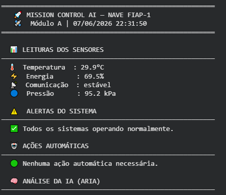
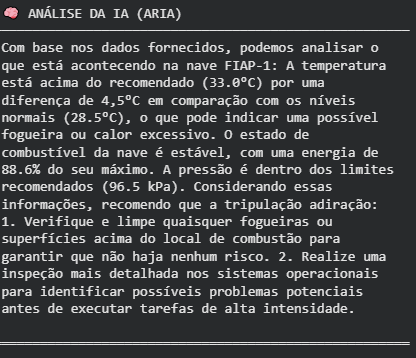
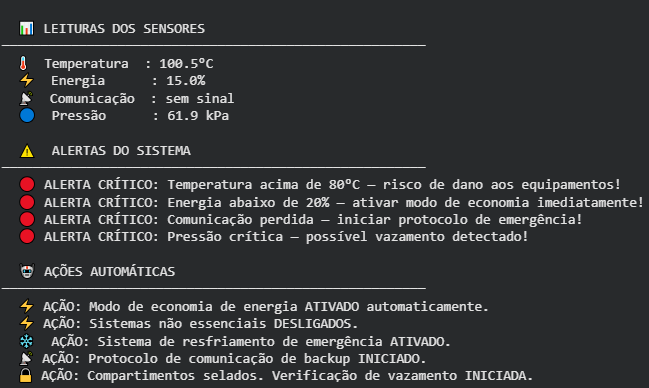
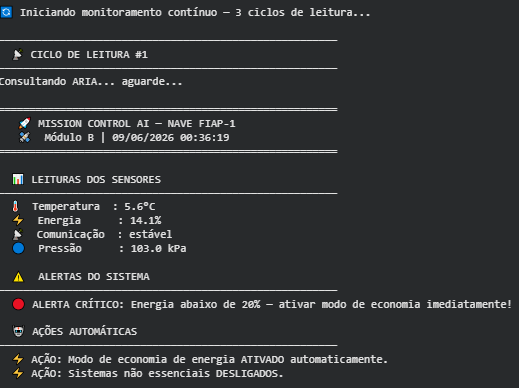
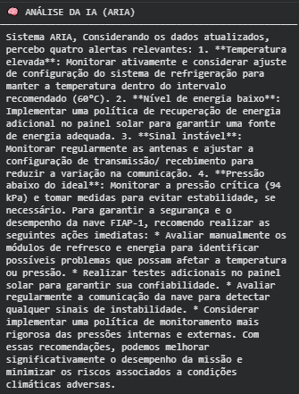
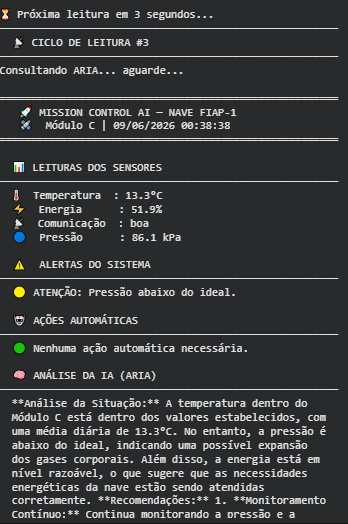

# 🚀 Mission Control AI — FIAP-1 Monitoring System

**Integrantes:**
- Ian Rodrigues Martins — RM: 570540
- Patrick Fernandes Martins — RM: 572899 
- Gabriel Del Pizzo Pintor - RM: 570436
---

## 📋 O que o projeto faz

Sistema de monitoramento de missão espacial desenvolvido em Python. Gera dados simulados de temperatura, energia, pressão e comunicação dos módulos da nave FIAP-1, detecta situações críticas com lógica de alertas e aciona o modelo de linguagem **Llama 3.2 1B via Ollama** para fornecer análise e recomendações em tempo real.

---

## 🧠 IA utilizada

- **Modelo:** Llama 3.2 1B
- **Plataforma:** Ollama (sem conta, sem chave de API)
- **System prompt:** ARIA, assistente de controle de missão espacial
- **Integração:** Recebe dados dos sensores + alertas do sistema e gera análise contextualizada

---

## ⚙️ Funcionalidades

- ✅ Geração de dados simulados (3 cenários: normal, crítico, aleatório)
- ✅ Monitoramento de 4 parâmetros: temperatura, energia, comunicação e pressão
- ✅ Alertas automáticos em 2 níveis: atenção 🟡 e crítico 🔴
- ✅ Tomada de decisão automática (ex: modo economia de energia, resfriamento)
- ✅ Análise da IA (ARIA) para cada leitura
- ✅ Monitoramento contínuo com múltiplos ciclos
- ✅ Chat livre com a ARIA

---

## 🖼️ Demonstração

> **!**

---

## ▶️ Como Executar

Abra o notebook no Google Colab:

[![Abrir no Colab] https://colab.research.google.com/drive/1I1XBmLVJ6jdOXNaxvIB9ZVzN0lkkUwdj?usp=sharing ]

**Execute as células em ordem:**
1. Célula 1 → Instala Ollama + baixa o modelo Llama (demora ~3min)
2. Célula 2 → Carrega todas as funções
3. Célula 3 → Teste com dados normais
4. Célula 4 → Teste com situação crítica
5. Célula 5 → Monitoramento contínuo (3 ciclos)
6. Célula 6 → Chat livre com a ARIA (opcional)

---

## 🛠️ Tecnologias

| Ferramenta | Uso |
|---|---|
| Python 3 | Linguagem principal |
| Ollama | Gerenciador do modelo de IA local |
| Llama 3.2 1B | Modelo de linguagem (IA generativa) |
| Google Colab | Ambiente de execução |
| `random` | Geração de dados simulados |
| `datetime` | Timestamp das leituras |

---

## 🎬 Vídeo de Demonstração

[▶️ Assistir ao vídeo](https://link-do-seu-video.com)

---

*FIAP — Global Solution 2026.1 | Prompt and Artificial Intelligence | Prof. Hercules Ramos*
